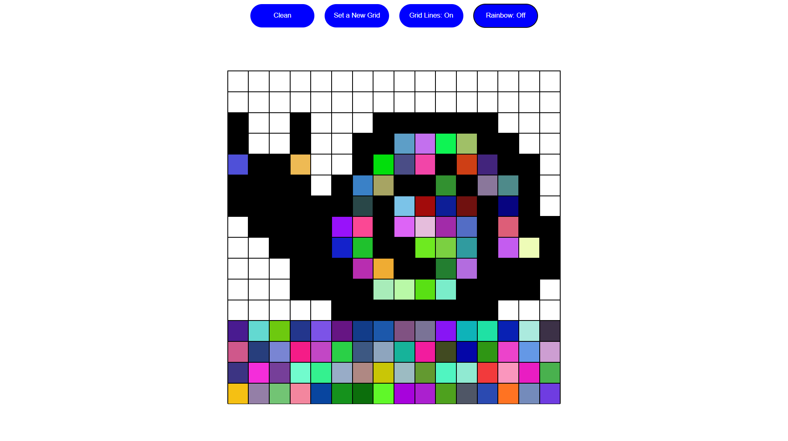
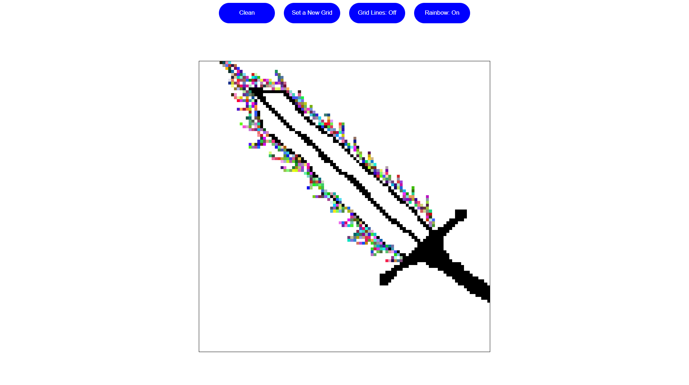

# 🎨 **Etch-a-Sketch**

  
  

This Etch-a-Sketch is one of the first interactive projects I built while learning web development.
It was inspired by the classic drawing toy and developed from scratch using HTML, CSS, and JavaScript.

This project helped me solidify my understanding of DOM manipulation, event handling, dynamic grid creation, and visual interaction on the web.

---
## 🕹️ **Live Demo**

👉 [Play Etch-a-Sketch](https://italoalulas.github.io/etch-a-sketch/)

---
## ⚙️ **Features**

- 🎨 Interactive drawing grid.
- 🔄 Dynamic grid resizing with user input.
- 🖱️ Real-time drawing using mouse hover.
- 🧹 Clear/reset function to restart the canvas.
- 🌈 Optional color modes (black and rainbow)

---
## 🧠 **Key Learnings**

- Creating and manipulating dynamic elements using JavaScript.
- Handling user events such as clicks and mouse movements.
- Implementing grid-based layouts with CSS.
